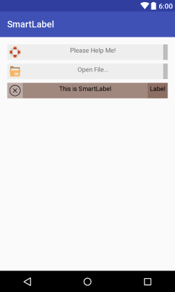

[](https://jitpack.io/#LinArcX/SmartLabel)

# SmartLabel
A Composit Smart View

## Preview


# Setup
## 1. Provide the gradle dependency

Add it in your root build.gradle at the end of repositories:
```gradle
allprojects {
	repositories {
		...
		maven { url "https://jitpack.io" }
	}
}
```
Add the dependency:
```gradle
dependencies {
	compile 'com.github.LinArcX:SmartLabel:0.1.2'
}
```

## 2. How to use

Add the SmartLabel in your layout file and customize it the way you like it.
```xml

```

Documanation is Here:
https://jitpack.io/com/github/LinArcX/SmartLabel/0.1.0/javadoc/
